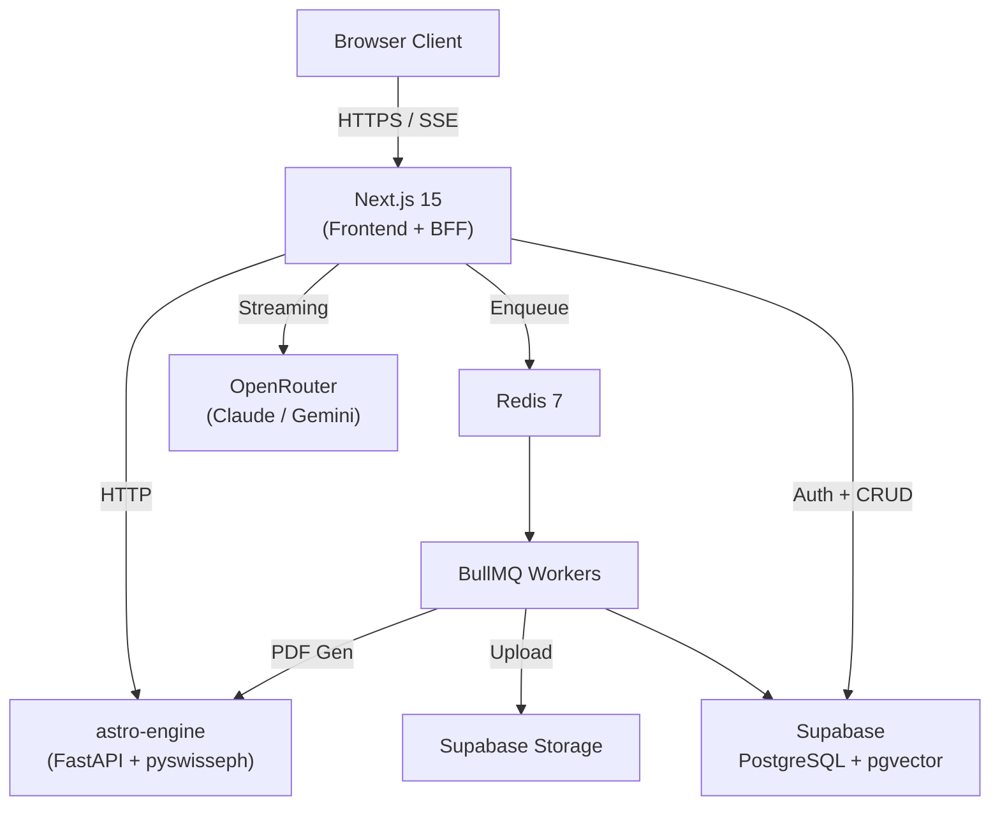

# JyotishAI

**AI-powered Vedic astrology platform generating ClickAstro-quality horoscope reports**


---

## What Is This?

JyotishAI is a full-stack Vedic astrology platform that combines Swiss Ephemeris precision calculations with LLM-powered report generation. It produces detailed horoscope reports comparable to commercial services like ClickAstro and AstroVision, but with interactive visualizations, AI-powered chat over your birth chart data, and proactive transit alerts.

Built for personal and family use as a portfolio-grade full-stack project.

---

## Features

- **9 Report Types** -- In-Depth Horoscope, Career, Wealth, Yearly, Jupiter/Saturn/Rahu-Ketu Transit, Numerology, and Gem Recommendation reports
- **Real-Time Streaming** -- Watch reports generate via Server-Sent Events with live markdown rendering
- **Interactive Kundli Charts** -- North Indian style birth chart rendered with D3.js SVG
- **3D Solar System** -- React Three Fiber visualization of planetary positions at birth
- **Dasha Timeline** -- Interactive scrollable Vimshottari dasha visualization
- **Yoga Detection** -- 25+ classical yogas from BPHS automatically detected and displayed
- **RAG-Powered Chat** -- Ask date-specific questions about your chart with hybrid vector + full-text search
- **Transit Alerts** -- Proactive notifications for significant planetary transits
- **PDF Export** -- ClickAstro-quality PDF reports via ReportLab
- **Bilingual** -- English and Hindi report generation (LLM handles both natively)
- **Family Vault** -- Unlimited family profiles with instant switching
- **Dark Mode** -- Full theme support via next-themes

---

## Architecture



See [full architecture documentation](docs/architecture/ARCHITECTURE.md) for detailed diagrams.

---

## Tech Stack

### Frontend

| Technology | Purpose |
|-----------|---------|
| Next.js 16 (App Router) | SSR, routing, API routes |
| React 19 | UI framework |
| TypeScript 5.7 | Type safety |
| Tailwind CSS 3.4 | Utility-first styling |
| shadcn/ui | Component primitives |
| D3.js 7.9 | Kundli chart SVG, dasha timeline |
| React Three Fiber 8.16 | 3D solar system visualization |
| Framer Motion 11 | Animations |
| Zustand 5.0 | Client state management |
| Zod 3.24 | Runtime validation |

### Backend

| Technology | Purpose |
|-----------|---------|
| FastAPI (Python 3.11) | Astrology calculation API |
| pyswisseph 2.10+ | Swiss Ephemeris bindings |
| ReportLab 4.2+ | PDF generation |
| BullMQ 5.22+ | Job queue (Node.js) |
| Redis 7 | Queue backend |

### Data and AI

| Technology | Purpose |
|-----------|---------|
| Supabase PostgreSQL | Database + Auth + Storage |
| pgvector | Vector similarity search (RAG) |
| OpenRouter | LLM gateway (Claude Sonnet 4.5, Gemini 2.0 Flash) |
| text-embedding-3-small | Embedding model (via OpenRouter) |

---

## Quick Start

### Prerequisites

- **Node.js** >= 20.9.0
- **Python** >= 3.11
- **Redis** (local or Upstash)
- **Supabase** project (free tier works)
- **OpenRouter** API key

### 1. Clone and Configure

```bash
git clone https://github.com/your-username/jyotish-ai.git
cd jyotish-ai

# Copy environment files
cp .env.example .env
cp web/.env.example web/.env.local   # if web/.env.example exists

# Edit .env with your actual keys:
#   NEXT_PUBLIC_SUPABASE_URL, NEXT_PUBLIC_SUPABASE_ANON_KEY,
#   SUPABASE_SERVICE_ROLE_KEY, OPENROUTER_API_KEY
```

### 2. Set Up Database

Run the migration in the Supabase SQL Editor:

```bash
# Copy the contents of supabase/migrations/001_initial_schema.sql
# and run it in: Supabase Dashboard > SQL Editor > New Query
```

This creates all tables (profiles, reports, report_chunks, chat_sessions, chat_messages, user_preferences, transit_alerts), enables pgvector, sets up RLS policies, and creates the hybrid search function.

### 3. Start astro-engine

```bash
cd astro-engine

# Create virtual environment
python -m venv venv
source venv/bin/activate    # Windows: venv\Scripts\activate

# Install dependencies
pip install -r requirements.txt

# Start the server (port 8000)
python main.py
```

### 4. Start the Web App

```bash
cd web

# Install dependencies
npm install

# Start dev server (port 3001)
npm run dev
```

### 5. Start Workers (Optional, for PDF generation and alerts)

```bash
cd web

# In separate terminals:
npm run worker        # Report PDF generation worker
npm run alert-worker  # Transit alert worker
```

### 6. Open the App

Navigate to `http://localhost:3001` in your browser.

---

## Docker (Full Stack)

Run the entire stack with Docker Compose:

```bash
# Build and start all services
docker-compose up --build

# Services started:
#   web:          http://localhost:3000
#   astro-engine: http://localhost:8000 (internal)
#   worker:       background process
#   redis:        redis://localhost:6379 (internal)
```

The `docker-compose.yml` orchestrates four services:
- **web**: Next.js application (depends on astro-engine health check)
- **astro-engine**: FastAPI calculation service
- **worker**: BullMQ workers for PDF and alert generation
- **redis**: Redis 7 Alpine with AOF persistence

---

## Project Structure

```
jyotish-ai/
|-- web/                              # Next.js 15 Application
|   |-- src/
|   |   |-- app/
|   |   |   |-- (auth)/              # Auth pages
|   |   |   |   |-- login/page.tsx
|   |   |   |   |-- signup/page.tsx
|   |   |   |-- (main)/              # Authenticated pages
|   |   |   |   |-- dashboard/       # Family profiles list + create
|   |   |   |   |-- profile/[id]/    # Birth chart, reports, chat
|   |   |   |   |-- settings/        # User preferences
|   |   |   |   |-- transits/        # Real-time transit tracker
|   |   |   |-- api/v1/              # BFF API routes
|   |   |   |   |-- auth/            # Login, signup
|   |   |   |   |-- profiles/        # CRUD family profiles
|   |   |   |   |-- calculate/       # Calls astro-engine
|   |   |   |   |-- reports/generate/ # Stream + save reports
|   |   |   |   |-- chat/            # RAG chat over chart
|   |   |   |   |-- transits/        # Current transits
|   |   |   |   |-- alerts/          # Transit alerts
|   |   |-- components/
|   |   |   |-- kundli/              # Birth chart SVG (D3.js)
|   |   |   |-- solar-system/        # 3D visualization (R3F)
|   |   |   |-- dasha/               # Dasha timeline (D3.js)
|   |   |   |-- yoga/                # Yoga cards (Framer Motion)
|   |   |   |-- transit/             # Transit wheel overlay
|   |   |   |-- reports/             # Streaming report viewer
|   |   |   |-- chat/                # RAG chat interface
|   |   |   |-- dashboard/           # Profile grid + cards
|   |   |   |-- layout/              # Header, Sidebar, ThemeProvider
|   |   |   |-- notifications/       # Alert bell
|   |   |-- lib/
|   |   |   |-- astro-client.ts      # HTTP client to astro-engine
|   |   |   |-- report-generator.ts  # OpenRouter streaming
|   |   |   |-- report-prompts/      # 9 prompt templates
|   |   |   |-- rag/                 # Chat, retriever, chunker, embedder
|   |   |   |-- workers/             # BullMQ queue + workers
|   |   |   |-- supabase/            # Client, server, types
|   |-- package.json
|
|-- astro-engine/                     # Python FastAPI Microservice
|   |-- main.py                      # App entry point
|   |-- routers/
|   |   |-- chart.py                 # Birth chart + transit endpoints
|   |   |-- dasha.py                 # Dasha calculation endpoints
|   |   |-- yogas.py                 # Yoga detection endpoints
|   |   |-- pdf.py                   # PDF generation endpoints
|   |-- core/
|   |   |-- calculator.py            # Swiss Ephemeris wrapper
|   |   |-- nakshatra.py             # 27 nakshatras + padas
|   |   |-- dasha.py                 # Vimshottari dasha engine
|   |   |-- yoga_rules.py            # 25+ yoga detection rules
|   |   |-- ashtakavarga.py          # Ashtakavarga calculations
|   |-- schemas/
|   |   |-- birth_data.py            # Pydantic models
|   |-- tests/
|   |   |-- test_calculator.py       # Accuracy tests vs ClickAstro
|   |-- requirements.txt
|   |-- Dockerfile
|
|-- supabase/
|   |-- migrations/
|       |-- 001_initial_schema.sql   # Full schema + RLS + functions
|
|-- docs/
|   |-- architecture/
|   |   |-- ARCHITECTURE.md          # Full system architecture
|   |   |-- QUEUE-SYSTEM.md          # BullMQ deep dive
|   |   |-- ASTRO-ENGINE.md          # Calculation engine deep dive
|
|-- docker-compose.yml               # Multi-service orchestration
|-- .env.example                     # Environment variable template
|-- CLAUDE.md                        # AI agent instructions
```

---

## Report Types

| # | Report | Description |
|---|--------|-------------|
| 1 | In-Depth Horoscope | Full life analysis (50+ pages) |
| 2 | Career & Business | Career path, professional strengths |
| 3 | Wealth & Fortune | Financial prospects, wealth yogas |
| 4 | Yearly Horoscope | Year-ahead predictions |
| 5 | Jupiter Transit | Jupiter transit effects on natal chart |
| 6 | Saturn Transit | Saturn transit (Sade Sati, Dhaiya) analysis |
| 7 | Rahu-Ketu Transit | Nodal transit predictions |
| 8 | Numerology | Birth, name, and destiny numbers |
| 9 | Gem Recommendation | Gemstone suggestions based on chart |

---

## Deployment

### Production Architecture

| Service | Platform | Tier |
|---------|----------|------|
| Next.js + Workers | Dokploy (Hostinger VPS) | Docker containers |
| astro-engine | Dokploy (same VPS) | Docker container |
| Database | Supabase Cloud | Free tier |
| Redis | Upstash | Free tier |
| LLM | OpenRouter | Pay-per-use |

### Deployment Steps

1. Set up a Dokploy instance on your VPS
2. Configure environment variables in Dokploy
3. Point your domain to the VPS
4. Deploy via `docker-compose up -d`

---

## API Documentation

### Next.js BFF Routes (`/api/v1/`)

| Method | Endpoint | Description |
|--------|----------|-------------|
| `POST` | `/auth/signup` | Create account |
| `POST` | `/auth/login` | Sign in |
| `GET/POST` | `/profiles` | List / create profiles |
| `GET/PATCH/DELETE` | `/profiles/:id` | Read / update / delete profile |
| `POST` | `/calculate` | Calculate birth chart |
| `POST` | `/reports/generate` | Generate streaming report (SSE) |
| `POST` | `/chat` | RAG chat with chart (SSE) |
| `GET` | `/transits` | Current planetary positions |
| `GET/PATCH` | `/alerts` | Transit alerts |

### astro-engine Routes

| Method | Endpoint | Description |
|--------|----------|-------------|
| `POST` | `/chart` | Complete birth chart calculation |
| `GET` | `/chart/transits` | Current transit positions |
| `POST` | `/chart/transits/natal` | Transit aspects vs natal |
| `POST` | `/dasha` | 120-year dasha sequence |
| `POST` | `/dasha/current` | Active dasha periods |
| `POST` | `/yogas` | Detect all yogas |
| `POST` | `/pdf/report` | Generate PDF |

See [full API reference](docs/architecture/ARCHITECTURE.md#api-reference) for request/response schemas.

---

## Environment Variables

Create a `.env` file in the project root (for Docker) and `web/.env.local` (for local dev):

```env
# Supabase
NEXT_PUBLIC_SUPABASE_URL=https://your-project.supabase.co
NEXT_PUBLIC_SUPABASE_ANON_KEY=your-anon-key
SUPABASE_SERVICE_ROLE_KEY=your-service-role-key

# OpenRouter (LLM + Embeddings)
OPENROUTER_API_KEY=sk-or-...

# Astro Engine (docker-compose overrides to http://astro-engine:8000)
ASTRO_ENGINE_URL=http://localhost:8000

# Redis (docker-compose overrides to redis://redis:6379)
REDIS_URL=redis://localhost:6379

# App
NEXT_PUBLIC_APP_URL=http://localhost:3000
NEXT_PUBLIC_APP_NAME=JyotishAI

# CORS / Environment
ALLOWED_ORIGINS=http://localhost:3000
ENVIRONMENT=development

# WhatsApp Alerts (optional)
WHATSAPP_GATEWAY_URL=
WHATSAPP_API_KEY=
```

---

## Calculation Accuracy

The astro-engine is validated against ClickAstro output:

| Metric | Target | Status |
|--------|--------|--------|
| Planetary positions | +/- 1 arcminute | Swiss Ephemeris standard |
| Ayanamsha (Lahiri) | Exact match | Chitrapaksha |
| Dasha balance at birth | Exact match | Verified vs ClickAstro |
| Yoga detection | 25+ classical yogas | BPHS, Phaladeepika sources |
| House system | Whole Sign | Vedic standard |

Test reference: DOB 18 Feb 1994, 23:07 IST, Raipur (21.14 N, 81.38 E)

---

## Documentation

- [System Architecture](docs/architecture/ARCHITECTURE.md) -- Full architecture with 10+ Mermaid diagrams
- [Queue System](docs/architecture/QUEUE-SYSTEM.md) -- BullMQ deep dive (workers, retry, monitoring)
- [Astro Engine](docs/architecture/ASTRO-ENGINE.md) -- Calculation pipeline, yoga rules, API contract

---

## License

Private -- Personal/Family Use + Portfolio

---

## Author

Prabhat Tiwari
