# JyotishAI -- System Architecture

## Overview

JyotishAI is an AI-powered Vedic astrology platform that generates ClickAstro/AstroVision-quality horoscope reports for personal and family use. The system combines high-precision astronomical calculations (via the Swiss Ephemeris) with large language model inference (via OpenRouter) to produce detailed, personalized astrological reports in English and Hindi.

The platform is structured as a multi-service architecture: a Next.js 15 frontend acting as both the user interface and a Backend-for-Frontend (BFF) API layer; a dedicated Python FastAPI microservice (`astro-engine`) for all Vedic astrology calculations; a BullMQ-based asynchronous job system for PDF generation and transit alert processing; Supabase PostgreSQL for persistent storage with Row Level Security; and Redis for queue management and job coordination.

All services are containerized with Docker and orchestrated via `docker-compose`. The platform is designed for private/family deployment on a single VPS (Dokploy on Hostinger) with cloud-managed data stores (Supabase, Upstash Redis).

---

## High-Level Architecture

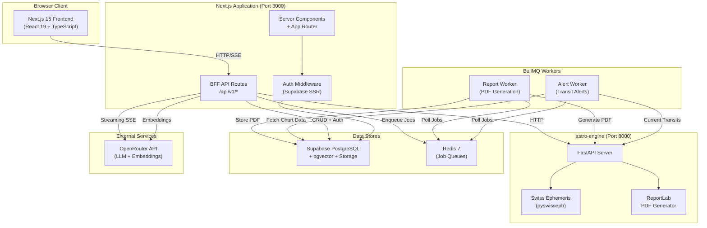

---

## Service Topology

| Service | Technology | Port | Deployment | Purpose |
|---------|-----------|------|------------|---------|
| `web` | Next.js 15 + React 19 + TypeScript | 3000 (prod) / 3001 (dev) | Docker / Dokploy VPS | Frontend UI + BFF API routes |
| `astro-engine` | FastAPI + Python 3.11 | 8000 | Docker / Dokploy VPS | Vedic astrology calculations, PDF generation |
| `worker` | Node.js + BullMQ | N/A (background) | Docker / Dokploy VPS | Async PDF generation and alert processing |
| `redis` | Redis 7 Alpine | 6379 | Docker (local) / Upstash (prod) | Job queue backend, pub/sub |
| Supabase | PostgreSQL 15 + pgvector | 5432 (managed) | Supabase Cloud | Database, auth, storage, RLS |
| OpenRouter | REST API | 443 | Cloud | LLM inference (Claude/Gemini) + embeddings |

---

## Data Flow Diagrams

### Report Generation Flow

This is the primary workflow -- a user requests a horoscope report and watches it stream in real-time. After streaming completes, the report is chunked, embedded for RAG, and a PDF generation job is queued.

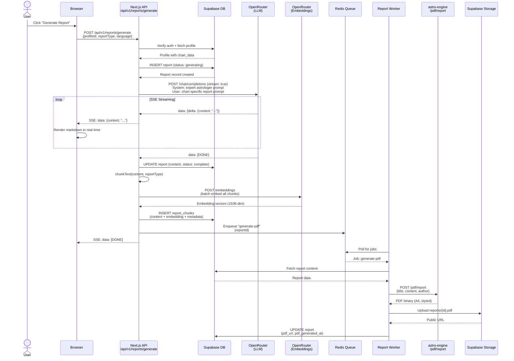

### RAG Chat Flow

Users can ask date-specific questions about their birth chart. The system retrieves relevant report chunks via hybrid search (vector + full-text) and combines them with live chart data for context-aware responses.

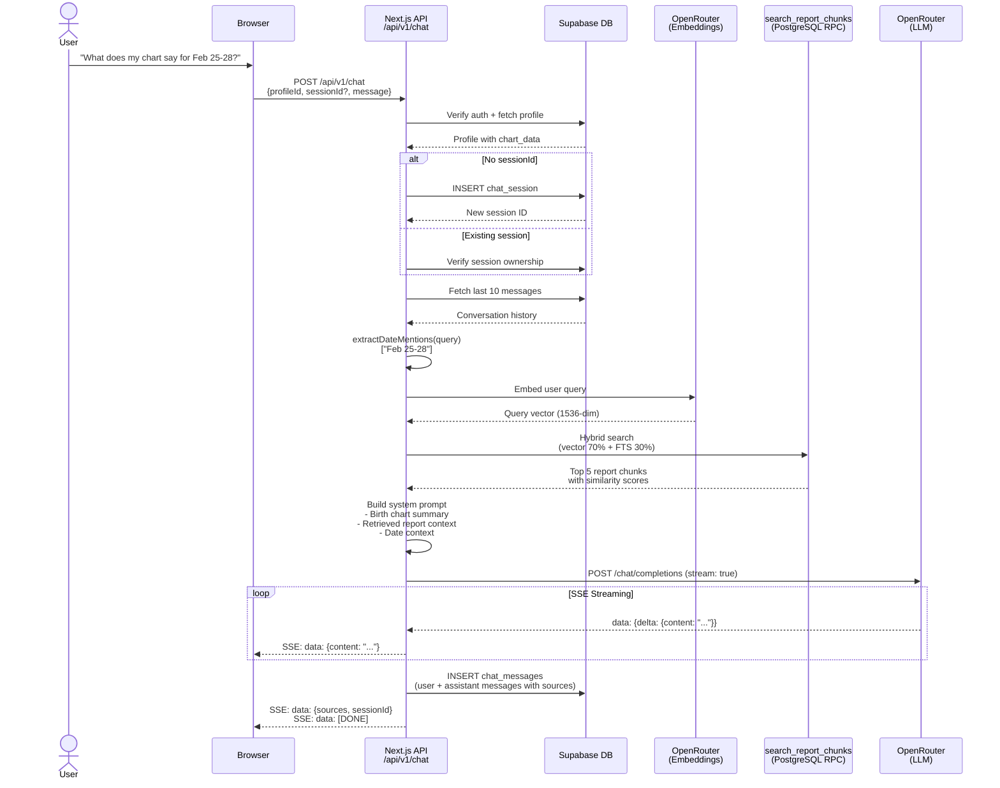

### Daily Transit Alert Flow

A scheduled job (or on-demand trigger) calculates current planetary transits, compares them against each family member's natal chart, and creates alert records for significant aspects.

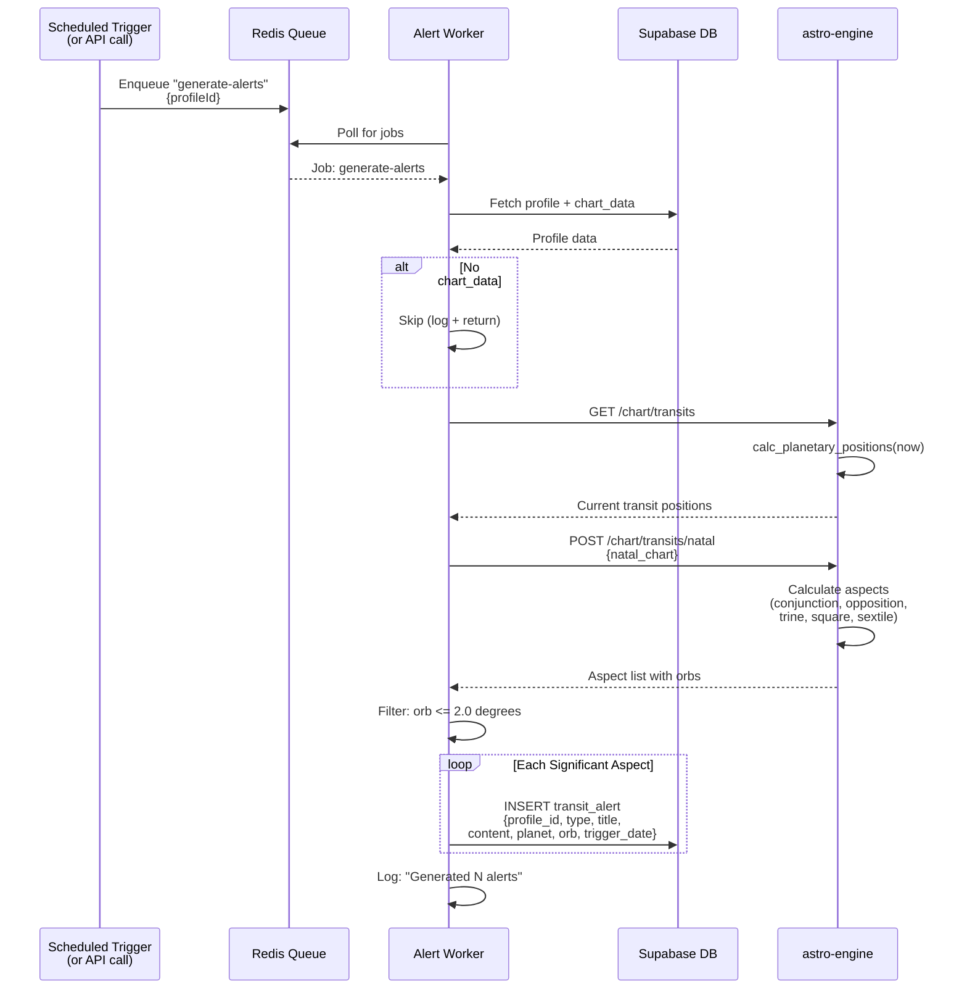

### Chart Calculation Flow

When a user creates a profile and calculates their birth chart, the Next.js BFF calls the astro-engine which runs the full Vedic calculation pipeline.

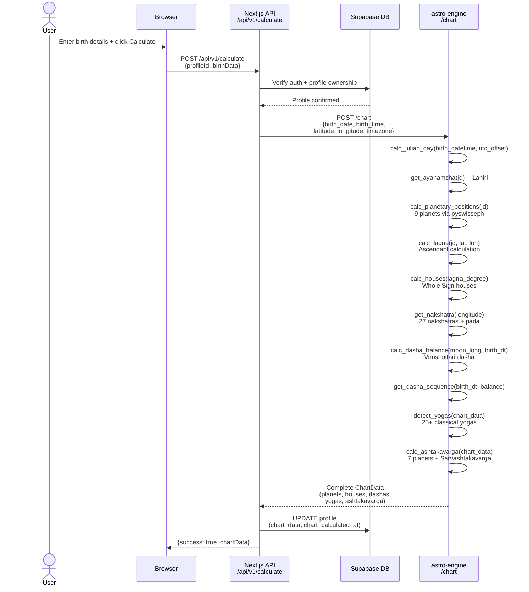

---

## Component Architecture

### Next.js Application

The Next.js application serves as both the frontend and the BFF (Backend-for-Frontend) API layer.

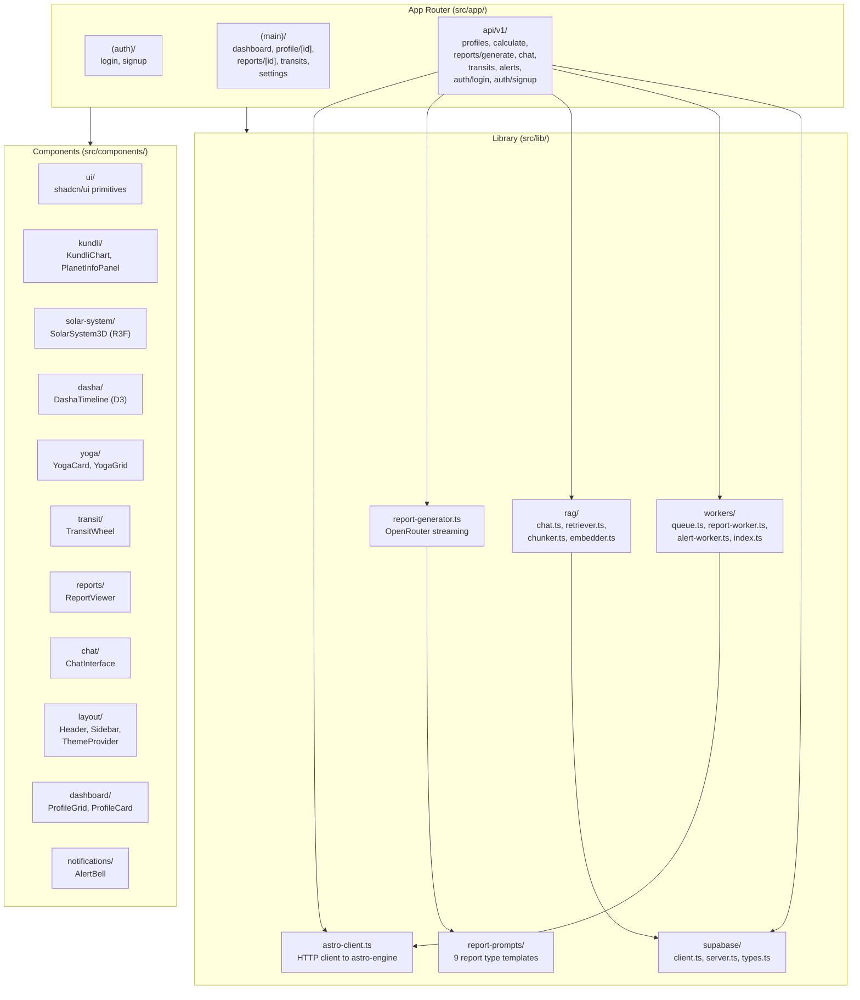

### astro-engine (Python Domain Microservice)

The astro-engine is a stateless FastAPI microservice dedicated to astronomical calculations and PDF generation.

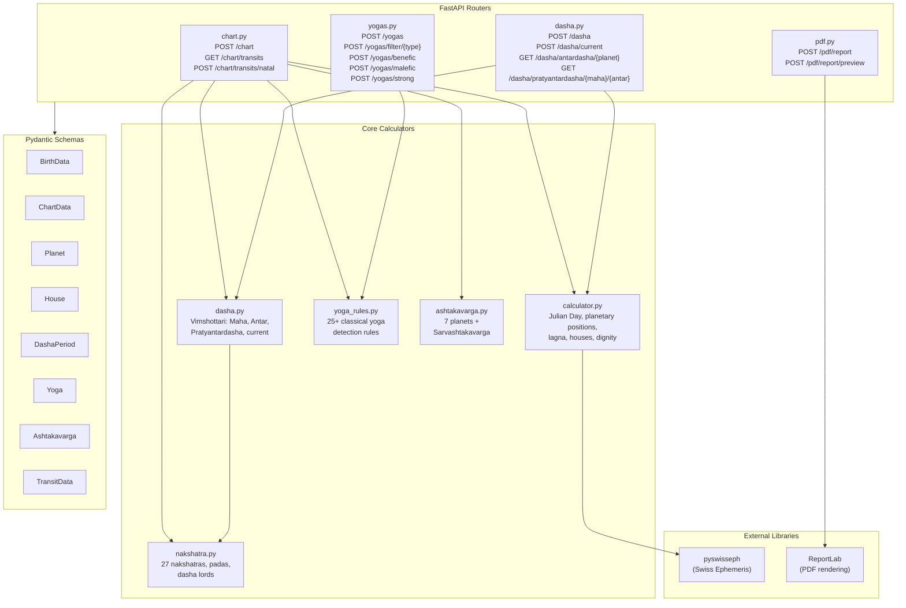

### BullMQ Job System

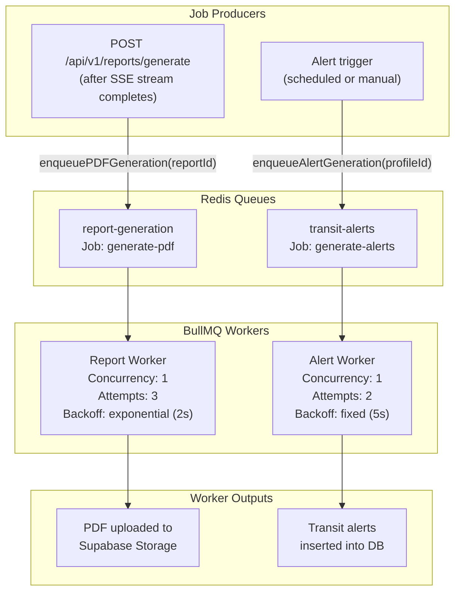

---

## Database Schema (ERD)

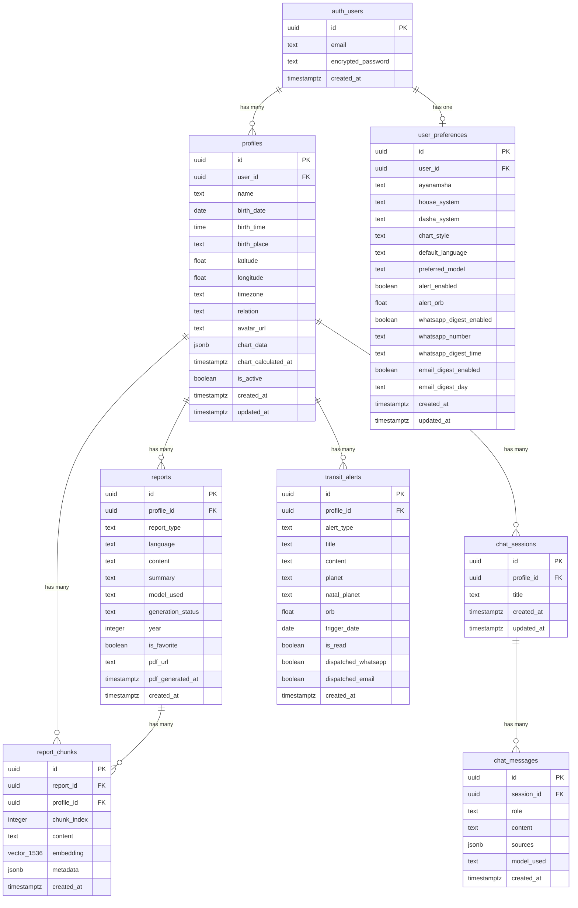

---

## API Reference

### Next.js API Routes (BFF Layer)

All routes are prefixed with `/api/v1/`. Authentication is enforced via Supabase Auth (`supabase.auth.getUser()`). Input validation uses Zod schemas.

| Method | Path | Auth | Description | Request Body | Response |
|--------|------|------|-------------|-------------|----------|
| `POST` | `/api/v1/auth/signup` | No | Create new user account | `{email, password}` | `{user}` |
| `POST` | `/api/v1/auth/login` | No | Sign in with email/password | `{email, password}` | `{user}` |
| `GET` | `/api/v1/profiles` | Yes | List all user profiles | -- | `Profile[]` |
| `POST` | `/api/v1/profiles` | Yes | Create family profile | `{name, birth_date, birth_time, birth_place, latitude, longitude, timezone, relation?, avatar_url?}` | `Profile` |
| `GET` | `/api/v1/profiles/:id` | Yes | Get single profile | -- | `Profile` |
| `PATCH` | `/api/v1/profiles/:id` | Yes | Update profile fields | Partial `Profile` fields | `Profile` |
| `DELETE` | `/api/v1/profiles/:id` | Yes | Delete profile (cascades) | -- | `{success: true}` |
| `POST` | `/api/v1/calculate` | Yes | Calculate birth chart | `{profileId, birthData}` | `{success, chartData}` |
| `POST` | `/api/v1/reports/generate` | Yes | Generate streaming report | `{profileId, reportType, language?, model?}` | SSE stream |
| `POST` | `/api/v1/chat` | Yes | RAG chat with birth chart | `{profileId, sessionId?, message, model?}` | SSE stream |
| `GET` | `/api/v1/transits` | Yes | Current planetary transits | -- | `TransitData` |
| `GET` | `/api/v1/alerts` | Yes | List transit alerts | `?profileId=` (query param) | `TransitAlert[]` |
| `PATCH` | `/api/v1/alerts` | Yes | Mark alert read/unread | `{alertId, is_read}` | `TransitAlert` |

### astro-engine Endpoints

All endpoints are served from the FastAPI application on port 8000. No authentication is required (internal service communication only).

| Method | Path | Description | Request Body | Response |
|--------|------|-------------|-------------|----------|
| `GET` | `/` | API info and endpoint listing | -- | `{name, version, endpoints}` |
| `GET` | `/health` | Health check | -- | `{status: "healthy"}` |
| `POST` | `/chart` | Calculate complete birth chart | `BirthData` | `ChartData` (planets, houses, dashas, yogas, ashtakavarga) |
| `GET` | `/chart/transits` | Current planetary positions | -- | `TransitData` |
| `POST` | `/chart/transits/natal` | Transit aspects vs natal chart | `ChartData` (natal) | `TransitVsNatalData` (aspects, significant transits) |
| `POST` | `/dasha` | Full 120-year dasha sequence | `BirthData` | `DashaSequence` |
| `POST` | `/dasha/current` | Current mahadasha/antardasha/pratyantardasha | `BirthData`, `?date=` | `{mahadasha, antardasha, pratyantardasha}` |
| `GET` | `/dasha/antardasha/:planet` | Antardasha periods for a mahadasha | `?start_date=&end_date=` | `{antardashas[]}` |
| `GET` | `/dasha/pratyantardasha/:maha/:antar` | Pratyantardasha periods | `?start_date=&end_date=` | `{pratyantardashas[]}` |
| `POST` | `/yogas` | Detect all yogas from chart | `ChartData` | `Yoga[]` |
| `POST` | `/yogas/filter/:type` | Filter yogas by type | `ChartData` | `Yoga[]` |
| `POST` | `/yogas/benefic` | Benefic yogas only | `ChartData` | `Yoga[]` |
| `POST` | `/yogas/malefic` | Malefic yogas only | `ChartData` | `Yoga[]` |
| `POST` | `/yogas/strong` | Strong/exceptional yogas only | `ChartData` | `Yoga[]` |
| `POST` | `/pdf/report` | Generate PDF (download) | `{title, content, author?, subject?}` | PDF binary stream |
| `POST` | `/pdf/report/preview` | Generate PDF (inline preview) | `{title, content, author?, subject?}` | PDF binary stream |

---

## Deployment Architecture

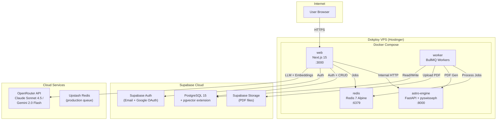

---

## Environment Variables Reference

| Variable | Service | Required | Description |
|----------|---------|----------|-------------|
| `NEXT_PUBLIC_SUPABASE_URL` | web, worker | Yes | Supabase project URL |
| `NEXT_PUBLIC_SUPABASE_ANON_KEY` | web | Yes | Supabase anonymous/public key |
| `SUPABASE_SERVICE_ROLE_KEY` | web, worker | Yes | Supabase service role key (server-only) |
| `OPENROUTER_API_KEY` | web, worker | Yes | OpenRouter API key for LLM + embeddings |
| `ASTRO_ENGINE_URL` | web, worker | Yes | URL to astro-engine (default: `http://localhost:8000`) |
| `REDIS_URL` | web, worker | Yes | Redis connection URL (default: `redis://localhost:6379`) |
| `NEXT_PUBLIC_APP_URL` | web | Yes | Public app URL (default: `http://localhost:3000`) |
| `NEXT_PUBLIC_APP_NAME` | web | No | App display name (default: `JyotishAI`) |
| `ENVIRONMENT` | astro-engine | No | `development` or `production` (controls docs endpoint) |
| `ALLOWED_ORIGINS` | astro-engine | No | Comma-separated CORS origins |
| `WHATSAPP_GATEWAY_URL` | web | No | WhatsApp notification gateway URL |
| `WHATSAPP_API_KEY` | web | No | WhatsApp gateway API key |

---

## Technology Stack

### Frontend

| Technology | Version | Purpose |
|-----------|---------|---------|
| Next.js | 16.x | App Router, SSR, API routes |
| React | 19.x | UI framework |
| TypeScript | 5.7 | Type safety |
| Tailwind CSS | 3.4 | Utility-first styling |
| shadcn/ui | latest | Component primitives |
| Framer Motion | 11.x | Animations (yoga cards, transitions) |
| D3.js | 7.9 | SVG chart rendering (kundli, dasha timeline) |
| React Three Fiber | 8.16 | 3D solar system visualization |
| @react-three/drei | 9.105 | R3F helpers |
| Three.js | 0.165 | 3D engine |
| Zustand | 5.0 | Client state management |
| react-hook-form | 7.54 | Form handling |
| react-markdown | 9.0 | Report content rendering |
| Lucide React | 0.460 | Icons |
| Zod | 3.24 | Runtime schema validation |

### Backend (astro-engine)

| Technology | Version | Purpose |
|-----------|---------|---------|
| Python | 3.11 | Runtime |
| FastAPI | 0.115+ | HTTP framework |
| Uvicorn | 0.30+ | ASGI server |
| pyswisseph | 2.10+ | Swiss Ephemeris bindings |
| Pydantic | 2.8+ | Data validation and serialization |
| ReportLab | 4.2+ | PDF generation |
| httpx | 0.27+ | HTTP client |

### Data and Infrastructure

| Technology | Version | Purpose |
|-----------|---------|---------|
| Supabase | Cloud | PostgreSQL + Auth + Storage |
| pgvector | Extension | Vector similarity search (RAG) |
| Redis | 7.x | Job queue backend |
| BullMQ | 5.22+ | Job queue library |
| IORedis | 5.4+ | Redis client for Node.js |
| Docker | Compose 3.9 | Container orchestration |

### AI/LLM

| Technology | Purpose |
|-----------|---------|
| OpenRouter API | LLM gateway |
| Claude Sonnet 4.5 | Primary report generation model |
| Gemini 2.0 Flash | Alternative model (user-togglable) |
| text-embedding-3-small | Embedding model (OpenAI via OpenRouter) |

---

## Security Model

### Authentication

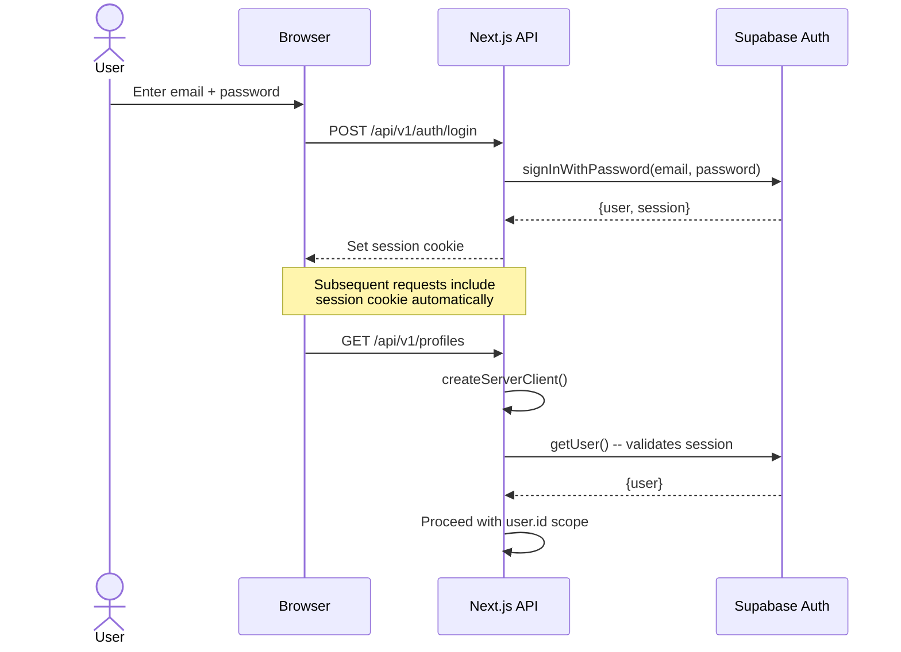

### Row Level Security (RLS)

All database tables have RLS enabled. Policies enforce that:

- **profiles**: Users can only CRUD their own profiles (`auth.uid() = user_id`)
- **reports**: Users can only access reports belonging to their profiles
- **report_chunks**: Scoped to profile ownership
- **chat_sessions**: Scoped to profile ownership
- **chat_messages**: Access via session ownership chain (messages -> sessions -> profiles -> user)
- **user_preferences**: Users can only access their own preferences (`auth.uid() = user_id`)
- **transit_alerts**: Scoped to profile ownership

### Defense-in-Depth

In addition to RLS policies, every API route performs an explicit auth check and scopes queries to `user_id`:

```
// Double-check: RLS + explicit user_id filter
const { data: profile } = await supabase
  .from("profiles")
  .select("*")
  .eq("id", profileId)
  .eq("user_id", user.id)  // Defense-in-depth
  .single();
```

### Input Validation

All API routes use Zod schemas for request body validation, preventing injection and mass-assignment attacks.

### CORS

The astro-engine uses CORS middleware configured via the `ALLOWED_ORIGINS` environment variable. In production, Swagger docs (`/docs`, `/redoc`) are disabled.

---

## Scaling Strategy

### Current Design (Personal/Family Use)

The system is designed for a single-user or small-family deployment:

- Single VPS with all Docker containers
- Supabase free tier for database and storage
- Upstash free tier for Redis
- Single worker process handling both report and alert queues

### Future Multi-User Scaling

If the platform were to scale to multiple users, the following changes would apply:

| Component | Current | Scaled |
|-----------|---------|--------|
| Web server | Single container | Horizontal scaling behind load balancer |
| astro-engine | Single container | Multiple replicas (stateless, easy to scale) |
| Workers | Single process, both queues | Separate worker pools per queue type |
| Redis | Local container or Upstash free | Managed Redis cluster (Upstash Pro, ElastiCache) |
| Database | Supabase free tier | Supabase Pro or self-hosted PostgreSQL with read replicas |
| Storage | Supabase Storage | CDN-fronted storage (CloudFront + S3) |
| LLM | OpenRouter pay-per-use | Rate limiting, request pooling, model fallback chain |
| Embeddings | Batch on report save | Background embedding pipeline with queue |
| Alerts | On-demand trigger | Cron-based scheduler (BullMQ repeatable jobs) |
