# JyotishAI -- Astro Engine (Python Calculation Microservice)

## Overview

The `astro-engine` is a stateless FastAPI microservice that encapsulates all Vedic astrology computations. It serves as the single source of truth for astronomical calculations, using the Swiss Ephemeris (via `pyswisseph`) for planetary position computation with arcminute-level precision.

The engine is called exclusively by the Next.js BFF layer and BullMQ workers over internal HTTP. It has no direct access to the database and no authentication requirements -- it is a pure computation service.

---

## Architecture

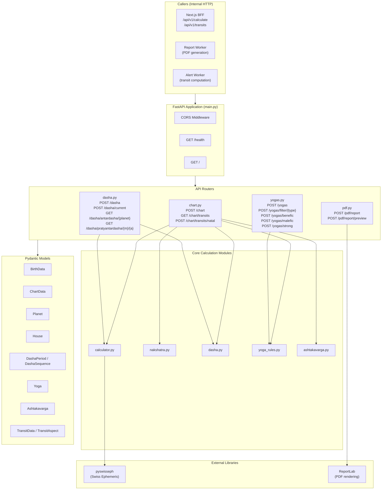

---

## Swiss Ephemeris Integration

### Configuration

The Swiss Ephemeris is initialized at module load time in `core/calculator.py`:

```python
import swisseph as swe

# Ephemeris data path (for Swiss Ephemeris data files)
EPHE_PATH = os.path.join(os.path.dirname(__file__), '..', 'ephe')
swe.set_ephe_path(EPHE_PATH)

# Set sidereal mode to Lahiri (Chitrapaksha) ayanamsha
swe.set_sid_mode(swe.SIDM_LAHIRI)
```

### Key Settings

| Setting | Value | Description |
|---------|-------|-------------|
| Ayanamsha | Lahiri (Chitrapaksha) | `swe.SIDM_LAHIRI` -- matches ClickAstro/AstroVision |
| House System | Whole Sign | Vedic standard; ascendant determines house boundaries |
| Node Calculation | Mean Node | `swe.MEAN_NODE` for Rahu; Ketu = Rahu + 180 degrees |
| Ephemeris Mode | Sidereal | `swe.FLG_SIDEREAL \| swe.FLG_SPEED` |
| Precision Target | +/- 1 arcminute | Swiss Ephemeris standard accuracy |

### Planets Tracked

| Planet | Swiss Ephemeris Constant | Notes |
|--------|------------------------|-------|
| Sun | `swe.SUN` | Never retrograde |
| Moon | `swe.MOON` | Never retrograde |
| Mars | `swe.MARS` | Retrograde when speed < 0 |
| Mercury | `swe.MERCURY` | Retrograde when speed < 0 |
| Jupiter | `swe.JUPITER` | Retrograde when speed < 0 |
| Venus | `swe.VENUS` | Retrograde when speed < 0 |
| Saturn | `swe.SATURN` | Retrograde when speed < 0 |
| Rahu | `swe.MEAN_NODE` | Always retrograde (mean node) |
| Ketu | Computed | 180 degrees opposite Rahu |

---

## Calculation Pipeline

### Birth Data to Complete Chart

When the `/chart` endpoint receives birth data, the following pipeline executes:

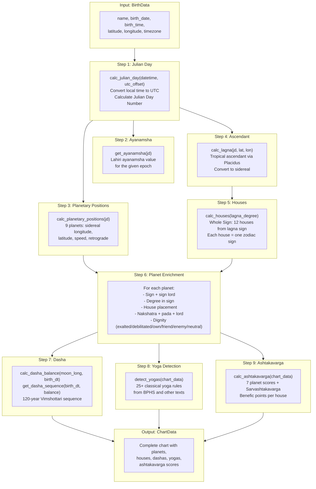

### Julian Day Calculation

The Julian Day is the foundation of all astronomical calculations. The engine converts local birth time to UTC, then computes the Julian Day Number:

```python
def calc_julian_day(dt: datetime, utc_offset_hours: float = 5.5) -> float:
    utc_dt = dt - timedelta(hours=utc_offset_hours)
    hour = utc_dt.hour + utc_dt.minute / 60.0 + utc_dt.second / 3600.0
    return swe.julday(utc_dt.year, utc_dt.month, utc_dt.day, hour)
```

The timezone is resolved from the birth data's `timezone` field (e.g., `Asia/Kolkata`) using Python's `zoneinfo` module, ensuring accurate UTC offset for any timezone worldwide.

### Ascendant (Lagna) Calculation

The ascendant is computed in two steps:

1. Calculate the tropical ascendant using the Placidus house system (via `swe.houses_ex`)
2. Convert to sidereal by subtracting the Lahiri ayanamsha

```python
def calc_lagna(jd: float, lat: float, lon: float) -> float:
    cusps, ascmc = swe.houses_ex(jd, lat, lon, b'P')  # Placidus
    ascendant_tropical = ascmc[0]
    ayanamsha = get_ayanamsha(jd)
    ascendant_sidereal = (ascendant_tropical - ayanamsha) % 360.0
    return ascendant_sidereal
```

### Whole Sign House System

Once the sidereal ascendant is known, house boundaries are determined by the sign the ascendant falls in. Each house occupies exactly one zodiac sign of 30 degrees:

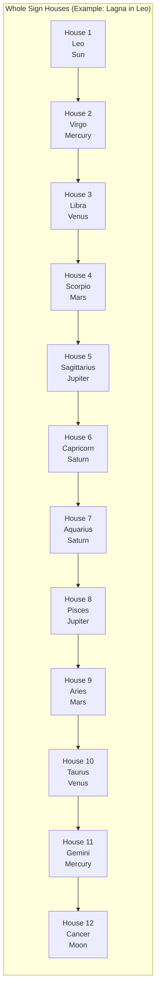

---

## Ayanamsha and House System Configuration

### Supported Ayanamsha Systems

The `BirthData` schema accepts an `ayanamsha` parameter with these options:

| Ayanamsha | Constant | Description |
|-----------|----------|-------------|
| `lahiri` (default) | `swe.SIDM_LAHIRI` | Chitrapaksha -- standard for Indian government, ClickAstro |
| `raman` | (available) | B.V. Raman's ayanamsha |
| `krishnamurti` | (available) | KP system ayanamsha |

Currently, the engine hardcodes Lahiri at module initialization. Future versions may support per-request ayanamsha switching.

### House System

Whole Sign is used exclusively. This is the traditional Vedic standard where:
- House 1 starts at 0 degrees of the ascendant's sign
- Each subsequent house is the next zodiac sign
- No unequal or intercepted houses

---

## Nakshatra System

### The 27 Nakshatras

The engine implements all 27 Vedic nakshatras, each spanning 13 degrees 20 minutes (13.333... degrees). Each nakshatra has a planetary lord that drives the Vimshottari dasha system.

**Source file**: `core/nakshatra.py`

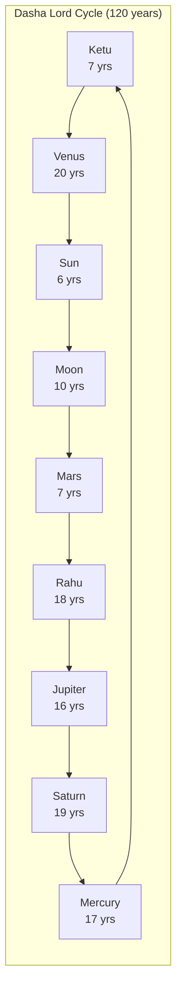

The nakshatra determination function finds which of the 27 nakshatras a given sidereal longitude falls in, and computes the pada (quarter, 1-4):

```python
def get_nakshatra(longitude: float) -> Dict:
    for nak in NAKSHATRA_DATA:
        if nak['start'] <= longitude < nak['end']:
            pada = int((longitude - nak['start']) / (nakshatra_span / 4)) + 1
            return {'name': nak['name'], 'number': nak['number'],
                    'lord': nak['lord'], 'pada': pada, ...}
```

---

## Dasha Calculation Engine

### Vimshottari Dasha System

The Vimshottari dasha system divides a 120-year life cycle into planetary periods based on the Moon's nakshatra at birth.

**Source file**: `core/dasha.py`

### Calculation Pipeline

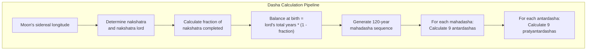

### Three Levels of Dasha Periods

| Level | Name | Count | Duration Formula |
|-------|------|-------|-----------------|
| 1 | Mahadasha | 9 periods | Based on planet's total years (6-20 years) |
| 2 | Antardasha | 9 per mahadasha | `(mahadasha_years * antardasha_lord_years) / 120` |
| 3 | Pratyantardasha | 9 per antardasha | `(antardasha_years * pratyantar_lord_years) / 120` |

### Balance at Birth

The first mahadasha period is partial -- the native enters the dasha cycle mid-period based on how far the Moon has traveled through its birth nakshatra:

```python
def calc_dasha_balance(moon_longitude, birth_datetime):
    nakshatra_info = get_nakshatra(moon_longitude)
    nakshatra_lord = nakshatra_info['lord']
    fraction_completed = (moon_longitude - nakshatra_info['degree_range_start']) / 13.333333
    balance_years = DASHA_YEARS[nakshatra_lord] * (1 - fraction_completed)
    return {'nakshatra_lord': nakshatra_lord, 'balance_years': balance_years}
```

### Current Dasha Lookup

The `/dasha/current` endpoint finds which mahadasha, antardasha, and pratyantardasha are active for any given date:

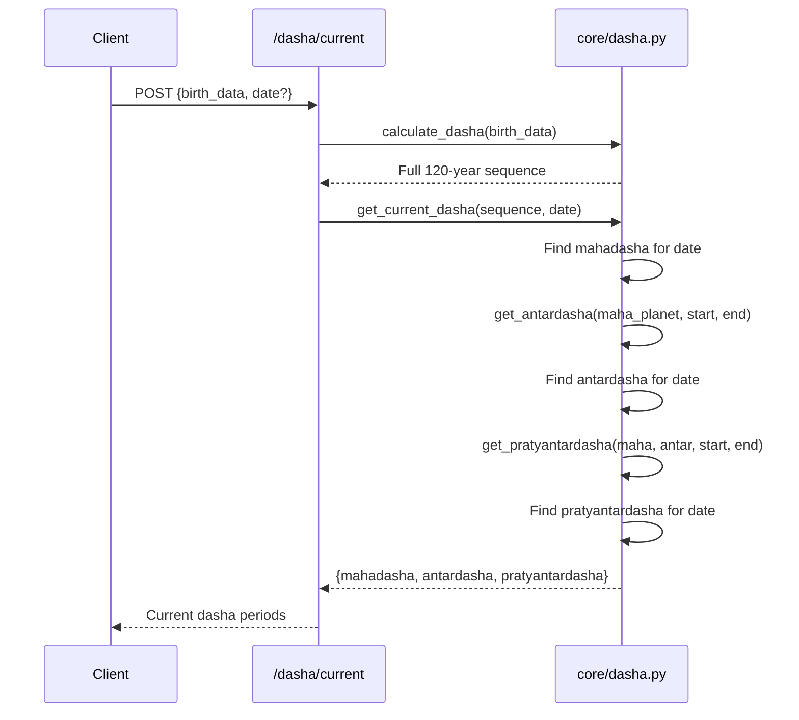

---

## Yoga Detection Engine

### Overview

The yoga detection engine (`core/yoga_rules.py`) implements 25+ classical Vedic astrology yogas from authoritative texts including Brihat Parashara Hora Shastra (BPHS) and Phaladeepika.

**Source file**: `core/yoga_rules.py`

### Yoga Categories

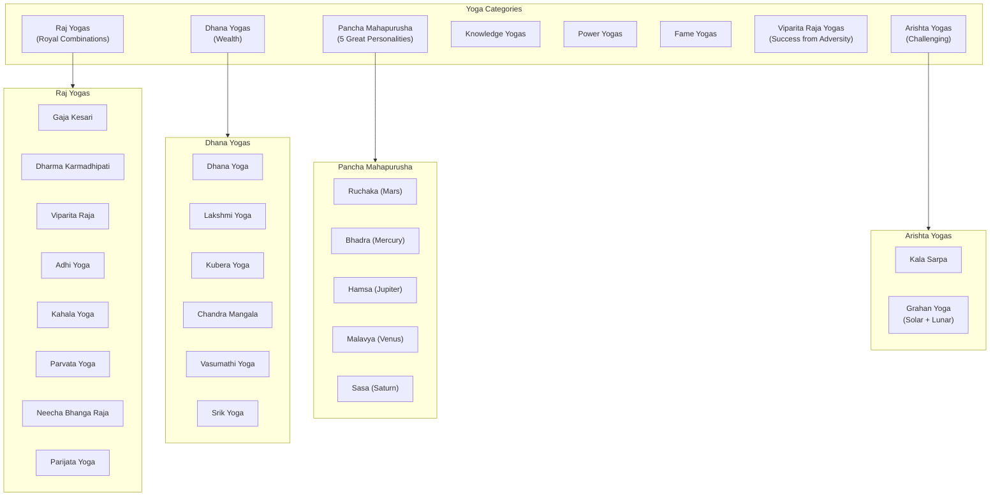

### Detection Logic

Each yoga has specific astronomical conditions that must be met. The `YogaDetector` class provides helper methods used across all rules:

| Helper Method | Purpose |
|--------------|---------|
| `_get_planet_house(planet)` | Get house number for a planet |
| `_get_house_lord(house)` | Get ruling planet of a house |
| `_planets_in_kendra(planets)` | Check if planets are in houses 1, 4, 7, or 10 |
| `_planets_in_trikona(planets)` | Check if planets are in houses 1, 5, or 9 |
| `_are_planets_conjunct(p1, p2, orb)` | Check if two planets are within orb degrees |

### Yoga Output Schema

Each detected yoga includes:

```python
class Yoga(BaseModel):
    name: str                    # "Gaja Kesari Yoga"
    type: str                    # raj, dhana, pancha_mahapurusha, arishta, etc.
    description: str             # Human-readable description
    strength: str                # weak, moderate, strong, exceptional
    planets_involved: List[str]  # ["Moon", "Jupiter"]
    houses_involved: List[int]   # [1, 4]
    classical_source: str        # "BPHS Chapter 41"
    benefic: bool                # True for benefic, False for malefic
```

### Implemented Yogas (25+)

| Yoga | Type | Condition |
|------|------|-----------|
| Gaja Kesari | raj | Moon and Jupiter in mutual kendras |
| Dharma Karmadhipati Raj | raj | Lords of 5th and 9th conjunct |
| Dhana | dhana | Lords of 2nd and 11th conjunct |
| Ruchaka | pancha_mahapurusha | Mars in kendra in own/exalted sign |
| Bhadra | pancha_mahapurusha | Mercury in kendra in own/exalted sign |
| Hamsa | pancha_mahapurusha | Jupiter in kendra in own/exalted sign |
| Malavya | pancha_mahapurusha | Venus in kendra in own/exalted sign |
| Sasa | pancha_mahapurusha | Saturn in kendra in own/exalted sign |
| Viparita Raja | raj | Lords of 6, 8, 12 in dusthana houses |
| Lakshmi | dhana | 9th lord in kendra/trikona + Venus in own/exalted sign |
| Kubera | dhana | Lords of 1st and 2nd conjunct |
| Budha Aditya | knowledge | Sun-Mercury conjunction within 8 degrees |
| Saraswati | knowledge | Mercury, Jupiter, Venus all in kendra/trikona |
| Chandra Mangala | dhana | Moon-Mars conjunction |
| Guru Mangala | power | Jupiter-Mars conjunction |
| Amala | fame | Benefic in 10th from Moon |
| Chamara | fame | Two benefics in house 1, 7, 9, or 10 |
| Adhi | raj | Benefics in all of 6th, 7th, and 8th from Moon |
| Kahala | raj | Lords of 4th and 9th in mutual kendras |
| Vasumathi | dhana | Benefics in upachaya houses (3, 6, 10, 11) |
| Parvata | raj | Lagna + 12th lords in kendra/trikona, benefics in kendras |
| Neecha Bhanga Raja | raj | Debilitated planet with cancellation |
| Parijata | raj | Ascendant lord's dispositor in kendra/trikona |
| Kala Sarpa | arishta | All planets between Rahu-Ketu axis |
| Grahan (Solar) | arishta | Sun conjunct Rahu/Ketu within 5 degrees |
| Grahan (Lunar) | arishta | Moon conjunct Rahu/Ketu within 5 degrees |
| Srik | dhana | Benefic in kendra from lagna lord |
| Voshi | knowledge | Planet in 12th from Sun |
| Ubhayachari | knowledge | Planets on both sides of Sun |
| Harsha | viparita_raj | Lord of 6th in dusthana |
| Sarala | viparita_raj | Lord of 8th in dusthana |
| Vimala | viparita_raj | Lord of 12th in dusthana |

---

## Ashtakavarga Calculation

### Overview

Ashtakavarga is a point-based system where each planet receives benefic points from other planets based on their relative positions. The engine calculates individual planet scores (Bhinnashtakavarga) and the combined total (Sarvashtakavarga).

**Source file**: `core/ashtakavarga.py`

### Calculation Flow

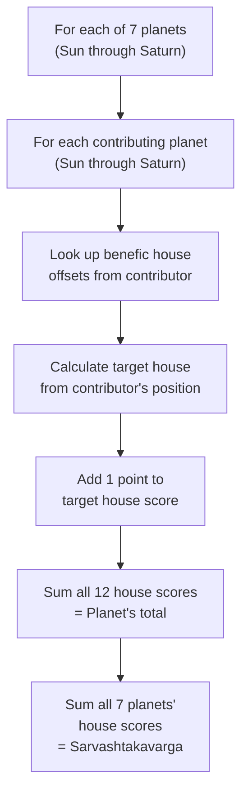

### Output

Each planet gets a 12-element array of scores (one per house), plus a total. The Sarvashtakavarga sums all individual scores per house.

---

## PDF Generation Pipeline

### Overview

The PDF generation endpoint accepts plain text or markdown content and produces a styled A4 PDF using ReportLab.

**Source file**: `routers/pdf.py`

### PDF Styling

| Element | Style |
|---------|-------|
| Title | 24pt, Gold (#c9a227), Helvetica Bold, centered |
| Headings | 16pt, Navy (#1e2d4a), Helvetica Bold |
| Body text | 11pt, Dark (#0f1729), Justified, 16pt leading |
| Bullet points | Indented, bullet character prefix |
| Page size | A4 (210mm x 297mm) |
| Margins | 72pt (1 inch) left/right/top, 18pt bottom |

### Content Parsing

The engine performs simple markdown-to-PDF conversion:

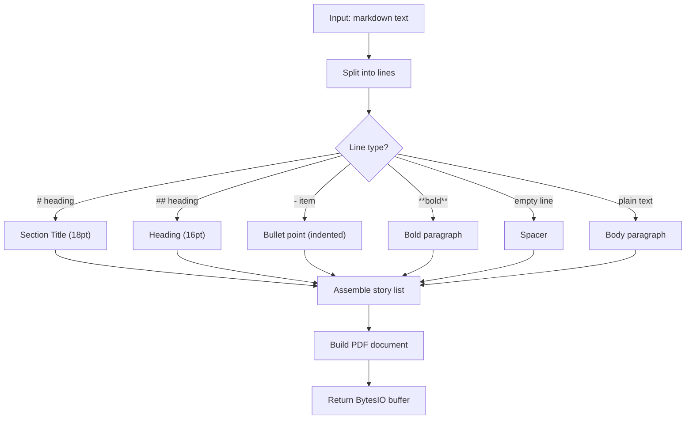

### Two Modes

| Endpoint | Content-Disposition | Use Case |
|----------|-------------------|----------|
| `POST /pdf/report` | `attachment` | Download PDF file |
| `POST /pdf/report/preview` | `inline` | View in browser |

---

## API Contract with Next.js

### Request/Response Schemas

All data exchange uses Pydantic models serialized as JSON.

#### BirthData (Input)

```python
class BirthData(BaseModel):
    name: Optional[str] = "Unknown"
    birth_date: date           # YYYY-MM-DD
    birth_time: time           # HH:MM:SS
    latitude: float            # -90 to 90
    longitude: float           # -180 to 180
    timezone: str = "Asia/Kolkata"
    ayanamsha: str = "lahiri"  # lahiri, raman, krishnamurti
```

#### ChartData (Output)

```python
class ChartData(BaseModel):
    birth_info: BirthData
    calculated_at: datetime
    julian_day: float
    ayanamsha: float           # Lahiri ayanamsha value for this epoch
    lagna: Planet              # Ascendant as a Planet object
    planets: List[Planet]      # 9 planets
    houses: List[House]        # 12 houses
    dasha_at_birth: DashaSequence  # 120-year dasha sequence
    yogas: List[Yoga]          # Detected yogas
    ashtakavarga: List[Ashtakavarga]  # Benefic point scores
```

#### Planet

```python
class Planet(BaseModel):
    name: str                  # "Sun", "Moon", "Mars", etc.
    longitude: float           # Sidereal longitude (0-360)
    latitude: float
    speed: float               # Degrees per day
    sign: str                  # "Aries", "Taurus", etc.
    sign_lord: str             # Ruling planet of the sign
    degree_in_sign: float      # 0-30
    house: int                 # 1-12
    nakshatra: str             # "Ashwini", "Bharani", etc.
    nakshatra_lord: str        # Dasha lord
    pada: int                  # 1-4
    is_retrograde: bool
    dignity: str               # exalted, debilitated, own_sign, friend, enemy, neutral
```

### Communication Pattern

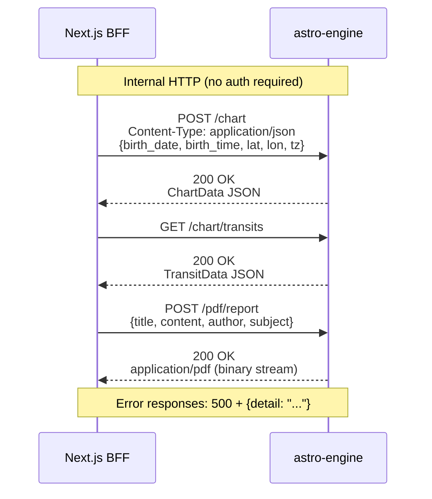

---

## Transit Calculation

### Current Transits

The `/chart/transits` endpoint calculates current planetary positions at the moment of the request:

1. Get current UTC datetime
2. Calculate Julian Day for now
3. Compute sidereal positions for all 9 planets
4. Return with nakshatra, sign, and degree information

### Transits vs Natal

The `/chart/transits/natal` endpoint calculates geometric aspects between transiting and natal planets:

| Aspect | Angular Separation | Orb Tolerance |
|--------|-------------------|---------------|
| Conjunction | 0 degrees | 5 degrees |
| Sextile | 60 degrees | 5 degrees |
| Square | 90 degrees | 5 degrees |
| Trine | 120 degrees | 5 degrees |
| Opposition | 180 degrees | 5 degrees |

An aspect is marked as "exact" if the orb is within 1 degree. Significant transits are flagged when slow-moving planets (Saturn, Jupiter, Rahu, Ketu) form conjunctions or oppositions with natal planets.

---

## Planetary Dignity System

The engine determines each planet's dignity (strength) based on its sign placement:

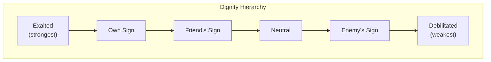

### Exaltation and Debilitation Signs

| Planet | Exaltation Sign | Debilitation Sign |
|--------|----------------|-------------------|
| Sun | Aries (10 deg) | Libra (10 deg) |
| Moon | Taurus (3 deg) | Scorpio (3 deg) |
| Mars | Capricorn (28 deg) | Cancer (28 deg) |
| Mercury | Virgo (15 deg) | Pisces (15 deg) |
| Jupiter | Cancer (5 deg) | Capricorn (5 deg) |
| Venus | Pisces (27 deg) | Virgo (27 deg) |
| Saturn | Libra (20 deg) | Aries (20 deg) |
| Rahu | Taurus (20 deg) | Scorpio (20 deg) |
| Ketu | Scorpio (20 deg) | Taurus (20 deg) |

---

## File Map

| File | Purpose |
|------|---------|
| `astro-engine/main.py` | FastAPI app setup, CORS, router registration, health check |
| `astro-engine/routers/chart.py` | Chart calculation, transit endpoints |
| `astro-engine/routers/dasha.py` | Dasha sequence, current dasha, sub-period endpoints |
| `astro-engine/routers/yogas.py` | Yoga detection and filtering endpoints |
| `astro-engine/routers/pdf.py` | PDF generation endpoints (download + preview) |
| `astro-engine/core/calculator.py` | Swiss Ephemeris wrapper: Julian Day, positions, lagna, houses, dignity |
| `astro-engine/core/nakshatra.py` | 27 nakshatra data, pada calculation, dasha lord mappings |
| `astro-engine/core/dasha.py` | Vimshottari dasha: balance, sequence, antardasha, pratyantardasha |
| `astro-engine/core/yoga_rules.py` | YogaDetector class with 25+ classical yoga rules |
| `astro-engine/core/ashtakavarga.py` | Ashtakavarga benefic point calculation |
| `astro-engine/schemas/birth_data.py` | Pydantic models: BirthData, ChartData, Planet, House, etc. |
| `astro-engine/requirements.txt` | Python dependencies |
| `astro-engine/Dockerfile` | Docker image (Python 3.11 slim, uvicorn) |
| `astro-engine/tests/test_calculator.py` | Calculator unit tests |

---

## Docker Configuration

The astro-engine runs as a Docker container with a health check:

```
FROM python:3.11-slim
WORKDIR /app
RUN apt-get update && apt-get install -y gcc g++
COPY requirements.txt .
RUN pip install --no-cache-dir -r requirements.txt
COPY . .
RUN mkdir -p /app/ephe
EXPOSE 8000
HEALTHCHECK --interval=30s --timeout=10s --start-period=40s --retries=3 \
    CMD python -c "import urllib.request; urllib.request.urlopen('http://localhost:8000/health')" || exit 1
CMD ["uvicorn", "main:app", "--host", "0.0.0.0", "--port", "8000"]
```

The `docker-compose.yml` configures the engine with:
- Health check that other services depend on
- `PYTHONUNBUFFERED=1` for real-time log output
- Configurable CORS origins and environment mode
