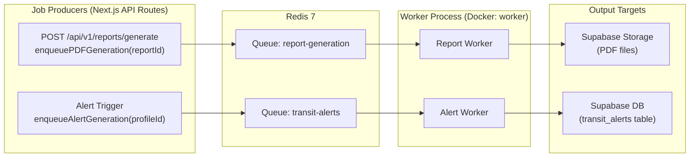
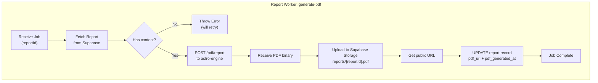
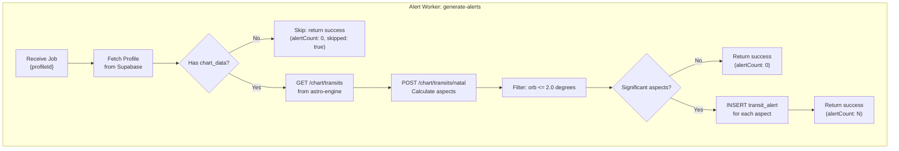
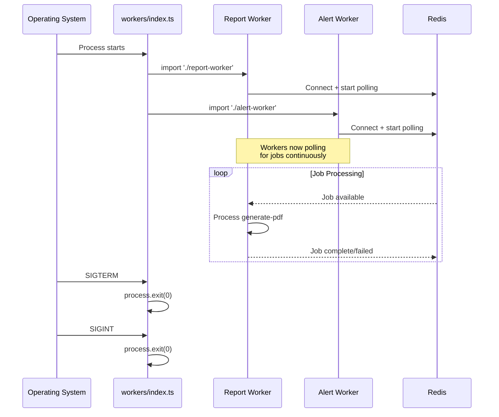
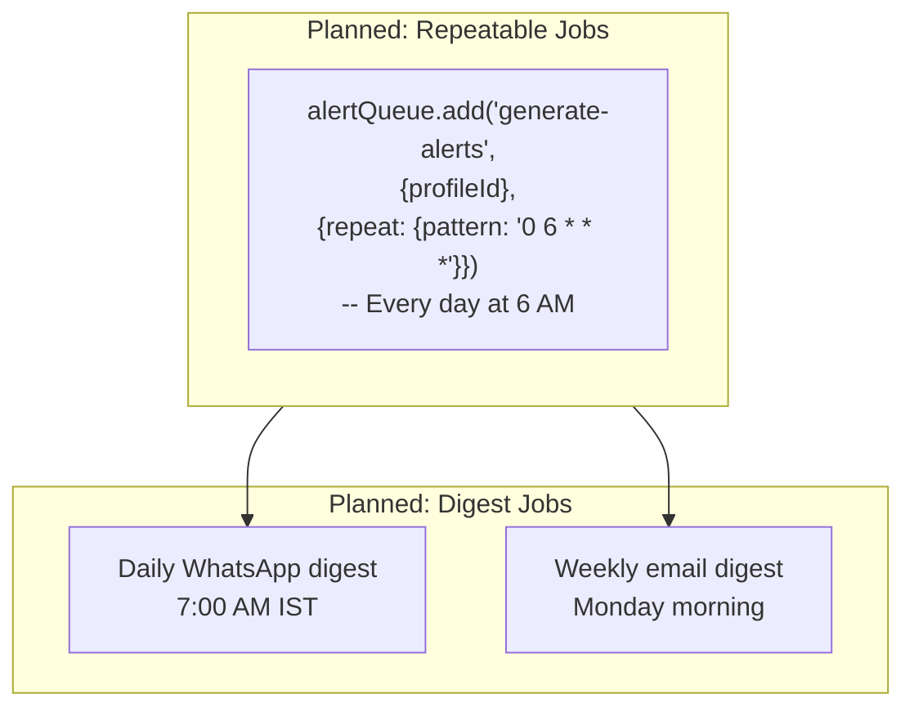
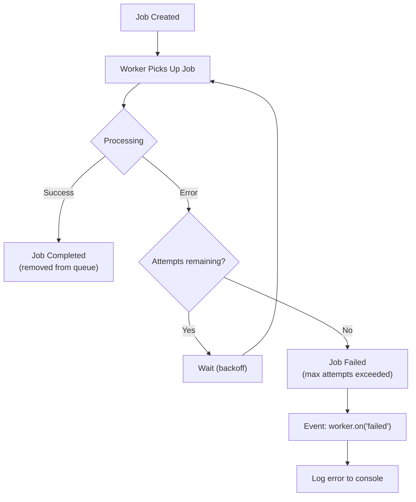
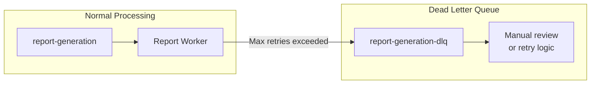

# JyotishAI -- BullMQ Queue System

## Overview

JyotishAI uses BullMQ (backed by Redis) for asynchronous job processing. There are two distinct queues: one for PDF report generation and one for transit alert computation. Both queues share a single Redis connection and are processed by dedicated workers that run as a separate Docker service.

The queue system decouples time-intensive operations (PDF rendering, astronomical computations for alerts) from the user-facing request/response cycle, ensuring the web application remains responsive.

---

## Architecture Overview



---

## Queue Definitions

### `report-generation` Queue

**Purpose**: Generates PDF files from completed report content. After an LLM-streamed report finishes writing to the database, the API route enqueues a PDF generation job.

**Source file**: `web/src/lib/workers/queue.ts`

```typescript
export const reportQueue = new Queue("report-generation", {
  connection: redisConnection,
});
```

**Job types**:

| Job Name | Payload | Description |
|----------|---------|-------------|
| `generate-pdf` | `{ reportId: string }` | Generate a PDF from a completed report |

**Enqueue function**:

```typescript
export async function enqueuePDFGeneration(reportId: string) {
  await reportQueue.add("generate-pdf", { reportId }, {
    attempts: 3,
    backoff: { type: "exponential", delay: 2000 },
  });
}
```

### `transit-alerts` Queue

**Purpose**: Computes current transit aspects against a natal chart and creates alert records for significant planetary configurations.

**Source file**: `web/src/lib/workers/queue.ts`

```typescript
export const alertQueue = new Queue("transit-alerts", {
  connection: redisConnection,
});
```

**Job types**:

| Job Name | Payload | Description |
|----------|---------|-------------|
| `generate-alerts` | `{ profileId: string }` | Calculate and store transit alerts for a profile |

**Enqueue function**:

```typescript
export async function enqueueAlertGeneration(profileId: string) {
  await alertQueue.add("generate-alerts", { profileId }, {
    attempts: 2,
    backoff: { type: "fixed", delay: 5000 },
  });
}
```

---

## Redis Connection

A single shared IORedis connection is used by all queues and workers. This avoids connection proliferation and is the recommended BullMQ pattern.

**Source file**: `web/src/lib/workers/queue.ts`

```typescript
const REDIS_URL = process.env.REDIS_URL || "redis://localhost:6379";

export const redisConnection = new IORedis(REDIS_URL, {
  maxRetriesPerRequest: null, // Required for BullMQ
});
```

The `maxRetriesPerRequest: null` setting is mandatory for BullMQ workers -- without it, IORedis will throw errors when blocking for jobs.

---

## Worker Configurations

### Report Worker

**Source file**: `web/src/lib/workers/report-worker.ts`



| Setting | Value | Rationale |
|---------|-------|-----------|
| Queue name | `report-generation` | Matches producer queue |
| Concurrency | 1 (default) | PDF generation is CPU-intensive |
| Max attempts | 3 | Network/service failures are transient |
| Backoff type | Exponential | 2s, 4s, 8s -- avoids overwhelming astro-engine |
| Backoff delay | 2000ms | Base delay |

**Failure scenarios**:

| Failure | Behavior |
|---------|----------|
| Report not found in DB | Throws error, job retries |
| Report has no content yet | Throws error, job retries (content may still be streaming) |
| astro-engine PDF endpoint fails | Throws error with HTTP status, job retries |
| Supabase Storage upload fails | Throws error, job retries |

### Alert Worker

**Source file**: `web/src/lib/workers/alert-worker.ts`



| Setting | Value | Rationale |
|---------|-------|-----------|
| Queue name | `transit-alerts` | Matches producer queue |
| Concurrency | 1 (default) | Computational work, sequential processing |
| Max attempts | 2 | Alert generation is less critical than PDF |
| Backoff type | Fixed | 5s flat delay between retries |
| Backoff delay | 5000ms | Fixed delay |
| Alert orb threshold | 2.0 degrees | Only tight aspects trigger alerts |

**Failure scenarios**:

| Failure | Behavior |
|---------|----------|
| Profile not found | Throws error, job retries |
| No chart_data on profile | Returns success with `skipped: true` (not an error) |
| astro-engine transit endpoint fails | Throws error, job retries |
| Supabase INSERT fails | Throws error, job retries |

---

## Worker Process Lifecycle

Both workers are started together from a single entry point.

**Source file**: `web/src/lib/workers/index.ts`



**NPM scripts for running workers**:

| Script | Command | Usage |
|--------|---------|-------|
| `npm run worker` | `tsx watch src/lib/workers/report-worker.ts` | Dev: report worker with hot reload |
| `npm run alert-worker` | `tsx watch src/lib/workers/alert-worker.ts` | Dev: alert worker with hot reload |

In Docker, the worker container runs both workers together via the entry point that imports both modules.

---

## Scheduled / Repeatable Job Patterns

Currently, alert generation is triggered on-demand (via API call or manual trigger). For production use, BullMQ's repeatable job feature can be used to schedule daily alert generation:



The `user_preferences` table already stores `whatsapp_digest_time` and `email_digest_day` fields to support per-user scheduling.

---

## Error Handling and Dead Letter Queue Strategy

### Retry Flow



### Current Error Handling

Both workers attach event listeners for completed and failed jobs:

```typescript
worker.on("completed", (job) => {
  console.log(`Job ${job.id} completed`);
});

worker.on("failed", (job, err) => {
  console.error(`Job ${job?.id} failed:`, err.message);
});
```

### Planned: Dead Letter Queue

For production reliability, a dead letter queue (DLQ) pattern can be added:



This would involve adding a `failedHandler` that moves exhausted jobs to a separate DLQ for manual inspection or delayed reprocessing.

---

## Monitoring and Observability

### Current State

Observability is console-based:

- Worker start/stop messages logged to stdout
- Per-job completion and failure logged with job ID
- Alert counts logged per profile

### Recommended Enhancements

| Area | Tool | Purpose |
|------|------|---------|
| Queue metrics | BullMQ Dashboard (Bull Board) | Visual queue inspection |
| Job latency | Custom Redis metrics | Track processing times |
| Error alerting | Structured logging + Sentry | Alert on repeated failures |
| Redis health | Upstash dashboard / redis-cli | Monitor memory, connections |

### Key Metrics to Track

| Metric | Description |
|--------|-------------|
| `report_queue.waiting` | Jobs waiting to be processed |
| `report_queue.active` | Jobs currently being processed |
| `report_queue.completed` | Total completed jobs |
| `report_queue.failed` | Total failed jobs |
| `alert_queue.waiting` | Alert jobs waiting |
| `job.duration.report_pdf` | Time to generate a PDF |
| `job.duration.alert_gen` | Time to generate alerts |

---

## Queue System File Map

| File | Purpose |
|------|---------|
| `web/src/lib/workers/queue.ts` | Redis connection, queue definitions, enqueue functions |
| `web/src/lib/workers/report-worker.ts` | Report PDF generation worker |
| `web/src/lib/workers/alert-worker.ts` | Transit alert generation worker |
| `web/src/lib/workers/index.ts` | Worker entry point (imports both workers, handles signals) |
| `docker-compose.yml` (worker service) | Docker configuration for worker container |
