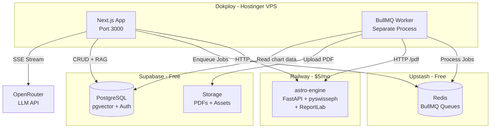
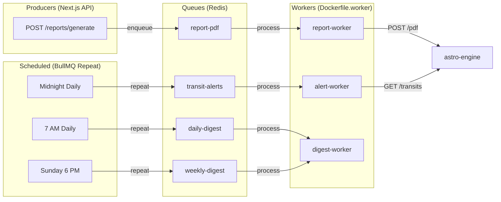
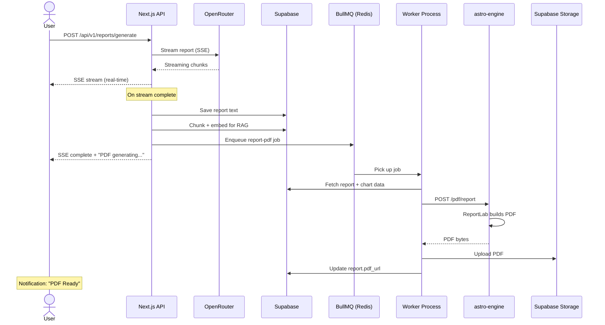
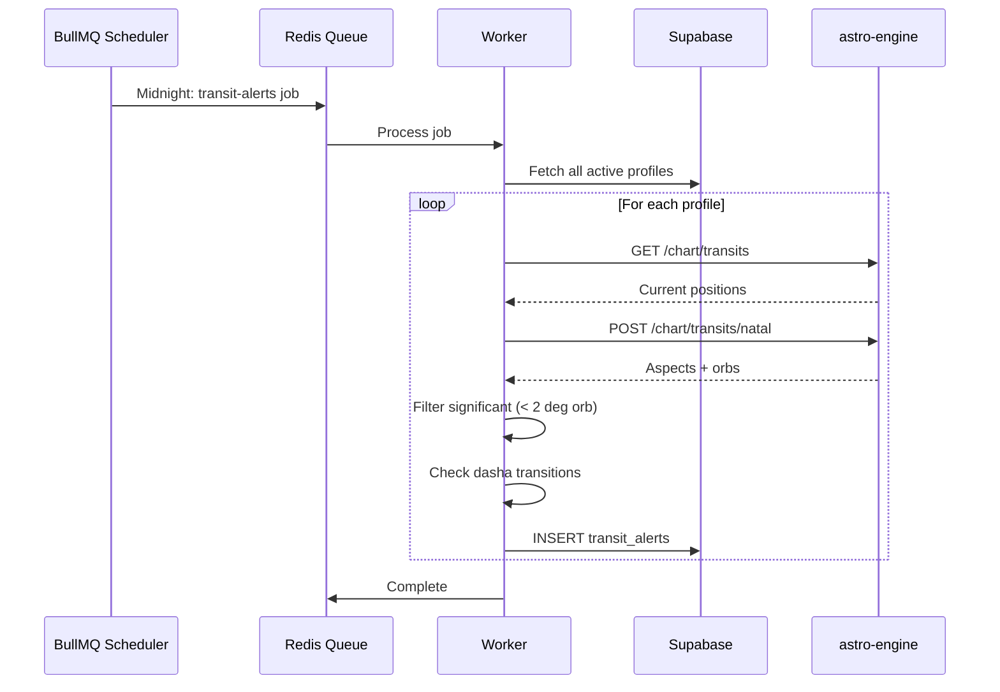
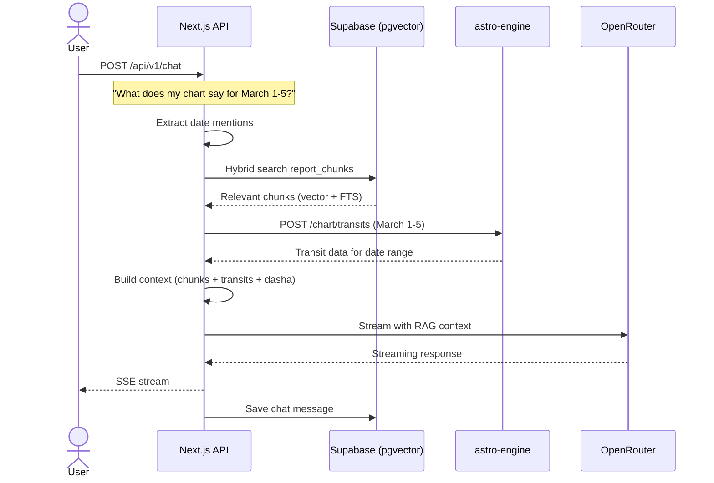

# JyotishAI Restructuring: EAKC-Style + Production-Grade BullMQ

**Date:** 2026-02-28
**Status:** Approved
**Author:** Claude (Brainstorming Agent)
**Devil's Advocate Review:** Completed

---

## 1. Problem Statement

JyotishAI currently uses a nested monorepo structure (`web/` + `astro-engine/` + `workers/`) that differs from our proven EAKC-MVP pattern. This creates:

- Deployment confusion (Railway can't auto-detect build targets)
- Extra nesting (`web/src/` instead of `src/`)
- Separate `workers/` directory with its own Dockerfile
- Docker-compose managing 4 services when only 2 need external deployment

## 2. Design Decision

**Flatten `web/` to root** (matching EAKC pattern) while **keeping BullMQ + Redis** for production-grade job processing. The astro-engine remains as a **domain microservice** (not a "sidecar" — it's too important for that label).

## 3. Architecture Overview



## 4. Directory Structure (Before → After)

### Before (Current)
```
jyotish-ai/
├── web/                    ← Extra nesting
│   ├── src/
│   │   ├── app/
│   │   ├── components/
│   │   └── lib/
│   │       └── workers/    ← Separate from main lib
│   ├── package.json
│   ├── Dockerfile
│   └── Dockerfile.worker
├── astro-engine/
├── docker-compose.yml
└── CLAUDE.md
```

### After (Restructured)
```
jyotish-ai/
├── src/                          ← Flattened to root
│   ├── app/
│   │   ├── (auth)/
│   │   ├── (main)/
│   │   └── api/v1/
│   ├── components/
│   │   ├── ui/
│   │   ├── kundli/
│   │   ├── solar-system/
│   │   ├── dasha/
│   │   ├── yoga/
│   │   ├── transit/
│   │   ├── reports/
│   │   ├── chat/
│   │   └── dashboard/
│   ├── lib/
│   │   ├── astro-client.ts
│   │   ├── report-generator.ts
│   │   ├── report-prompts/
│   │   ├── rag/
│   │   ├── supabase/
│   │   ├── redis/
│   │   ├── queue/              ← Restructured from workers/
│   │   │   ├── connection.ts
│   │   │   ├── queues.ts
│   │   │   ├── report-worker.ts
│   │   │   ├── alert-worker.ts
│   │   │   ├── digest-worker.ts
│   │   │   └── index.ts
│   │   └── store.ts
│   ├── hooks/
│   ├── types/
│   └── middleware.ts
├── astro-engine/                 ← Unchanged
│   ├── main.py
│   ├── core/
│   ├── routers/
│   ├── schemas/
│   ├── tests/
│   ├── ephe/
│   ├── requirements.txt
│   └── Dockerfile
├── supabase/migrations/
├── package.json                  ← Moved from web/
├── next.config.ts
├── tailwind.config.ts
├── tsconfig.json
├── Dockerfile                    ← Next.js only
├── Dockerfile.worker             ← BullMQ worker
├── docker-compose.yml            ← Updated paths
├── CLAUDE.md
└── docs/
```

## 5. BullMQ Queue Architecture



## 6. Data Flow Sequences

### 6.1 Report Generation



### 6.2 Daily Transit Alerts



### 6.3 RAG Chat



## 7. Migration File Map

| Source | Destination | Action |
|--------|------------|--------|
| `web/src/` | `src/` | Move |
| `web/package.json` | `package.json` | Move |
| `web/next.config.ts` | `next.config.ts` | Move |
| `web/tailwind.config.ts` | `tailwind.config.ts` | Move |
| `web/tsconfig.json` | `tsconfig.json` | Move |
| `web/postcss.config.mjs` | `postcss.config.mjs` | Move |
| `web/Dockerfile` | `Dockerfile` | Move |
| `web/Dockerfile.worker` | `Dockerfile.worker` | Move |
| `web/public/` | `public/` | Move |
| `web/.npmrc` | `.npmrc` | Move |
| `web/next-env.d.ts` | `next-env.d.ts` | Move |
| `src/lib/workers/` | `src/lib/queue/` | Rename + restructure |
| `astro-engine/` | `astro-engine/` | No change |
| `supabase/` | `supabase/` | No change |
| `docker-compose.yml` | `docker-compose.yml` | Update paths |
| `web/` | **Delete** | Empty after move |

## 8. Devil's Advocate Summary

| Concern | Severity | Resolution |
|---------|----------|------------|
| Dropping BullMQ/Redis | N/A | **Keeping BullMQ** — user confirmed |
| EAKC pattern fit | Low | Pattern works, renamed "domain microservice" |
| Railway hobby plan capacity | None | 8GB RAM overkill for pyswisseph |
| PDF generation strategy | Resolved | ReportLab stays in astro-engine |
| Scheduled jobs without queue | N/A | BullMQ repeat jobs handle this |
| "Not a monorepo" semantics | Low | Legitimate simplification: 3→2 services |
| astro-engine growth | None | HTTP boundary scales regardless |

## 9. Deployment Configuration

### Dokploy (Hostinger VPS)
- **Service 1:** Next.js app → `Dockerfile` (port 3000)
- **Service 2:** BullMQ worker → `Dockerfile.worker`

### Railway
- **Service:** astro-engine → `astro-engine/Dockerfile` (root dir: `/astro-engine`)

### External Services
- **Upstash Redis** (free tier) — BullMQ queue backend
- **Supabase** (free tier) — PostgreSQL + pgvector + Auth + Storage
- **OpenRouter** — LLM API gateway

## 10. Environment Variables

```env
# Supabase
NEXT_PUBLIC_SUPABASE_URL=https://mzzqsjdcqhfpjhtlrejg.supabase.co
NEXT_PUBLIC_SUPABASE_ANON_KEY=...
SUPABASE_SERVICE_ROLE_KEY=...

# Redis (Upstash)
UPSTASH_REDIS_URL=rediss://...@....upstash.io:6379

# Astro Engine
ASTRO_ENGINE_URL=https://your-app.railway.app

# LLM
OPENROUTER_API_KEY=...

# App
NEXT_PUBLIC_APP_URL=https://jyotish.adaptivesmartsystems.cc
```
